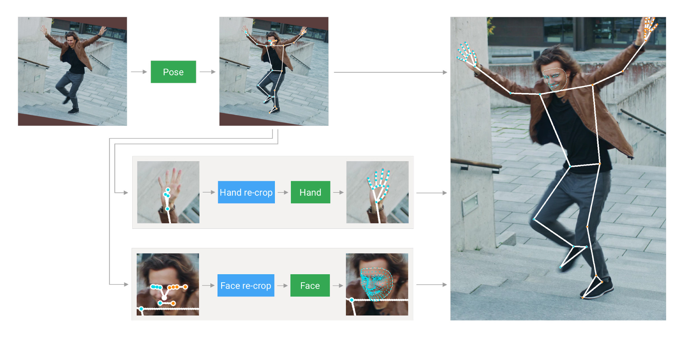

# Introducción

DmediaLearn es un programa diseñado para apoyar principalmente a los estudiantes en su aprendizaje. Permite que los docentes encargados agreguen preguntas de opción múltiple (con dos opciones), las cuales los estudiantes responden seleccionando con su mano la opción que consideren correcta. Esto se logra a través de un sistema de reconocimiento holístico y seguimiento en tiempo real del movimiento del estudiante.

## Reconocimiento Holístico (MediaPipe)

El reconocimiento holístico de MediaPipe es un modelo avanzado desarrollado por Google que utiliza aprendizaje automático para realizar el seguimiento y la detección de varias partes del cuerpo humano de manera simultánea. Este sistema integra datos de reconocimiento facial, detección de manos y pose corporal en un solo modelo unificado, permitiendo un análisis integral y en tiempo real de los movimientos y gestos del cuerpo.